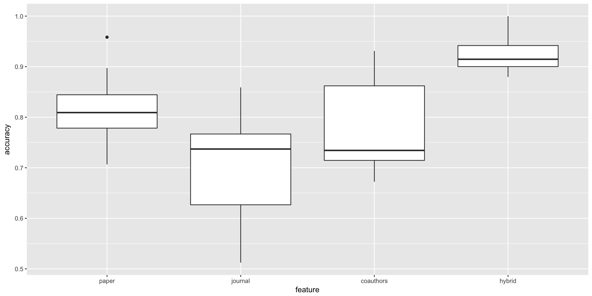

In this report we will study different methods of **Author Name Disambiguation**. It's the problem of determining whether records in a publications database refer to the same person.

There are two major challenges in author name disambiguation, synonyms and homonyms. In this project we focuses on the second challenge.

We will use domain specific knowledge such as co-aurthors, title of publications and title of journals to perform this task.

The goal of this report is to implement and compare two scientific publications.
(Paper 2)  Two supervised learning approaches for name disambiguation in author citations (Han et al. [2004]) - we will study the SVM part of this paper
(Paper 5) Author disambiguation using error-driven machine learning with a ranking loss function (Culotta et al. [2007]) - we will study the C/E/Pc part os this paper
Those two papers can be found in the repository under doc/papers

## Step 0: Load Pakages and Functions

```{r}

packages.used=c("stringr", "tex2vec", "caret", "gmum.r", "e1071", "plyr", "tidyr", "gridExtra")

# Check packages that need to be installed.
packages.needed=setdiff(packages.used, intersect(installed.packages()[,1], 
                                                 packages.used))

# Install packages
if(length(packages.needed)>0){
  install.packages(packages.needed, dependencies = TRUE,
                   repos='http://cran.us.r-project.org')
}

# Load packages
library(stringr)
library(text2vec)
library(caret)
library(gmum.r)
library(e1071)
library(plyr)
library(tidyr)
library(gridExtra)

# Source Functions
source("../lib/helper_load.R")
source("../lib/helper_model.R")
```


## Step 1: Load and Process data

The dataset is downloaded from http://clgiles.ist.psu.edu/data/
- There are 14 .txt files in the data folder. Each file is a collection of ambiguous names and associtated citations. e.g. AGupta.txt is the citation files of 26 “A. Gupta”s. The 14 canonical names are top ranked ambiguous names, such as “J. Lee”, “J Smith”, “S. Lee”and “Y. Chen” from the DBLP bibliography.
- The datasets are pre-processed as follows. All the author names in the citations were simpli- fied to first name initial and last name. For example, “Yong-Jik Kim” was simplified to “Y. Kim”. A reason for such simplification is that the first name initial and last name format is popular in citation records. Publication dates are eliminate from citations.
- All citations in the raw data are in the format of
clusterid citationid authors;authors;...<>paper title<>publication venue title, where clusterid indicates the canonical author id.

```{r}
### Dataset - Extract Files' Names
files <- list.files(path = "../data/nameset", pattern = "*.txt")
files <- substr(files, 1, nchar(files)-4)
# Create list of auhtors with good format "F Lastname"
authors <- paste(substring(files, 1, 1), " ", 
                 substring(files, 2, nchar(files)), sep="")

### Upload & Clean Dataset
# Format: Nested List - Upper Level: per homonym - Lower Level: one list per record
# Initialize dataset
dataset <- list(length(files))
for(i in 1:length(files)){
  temp <- as.list(readLines(paste0("../data/nameset/", files[i],".txt")))
  dataset[[i]] <- lapply(temp, clean.record, author=authors[i])
}
```

## Step 2: Implement Paper 2

**Brief Description of the Paper**
This paper is using both SVM and Naive Bayes to perform Name Disambiguation. We will be studying the SVM part.   
The author consider each individual author has a class, and perform multiclass one-versus-all SVM to separate the differetn classes. The feeatures used are multiples. They first consider the co-authors, then the title of the paper and finally the journal. Additionally they test an hybrid method using all those features.  
We will reproduce those tests on the datasets that we have.  

**Feature Creation**
The very first step is to process the clean data and to extract the necessary features. At first, we will conduct the evaluation of the paper on the first dataset only (the name set is A Gupta)

We will process the data in a dataframe.
```{r}
# Change Format - Data Frame
df <- data.frame(matrix(unlist(dataset[[1]]), 
                        nrow=length(dataset[[1]]), byrow=T), 
                 stringsAsFactors=FALSE)

# Update columns' names
names(df) <- c("author.id", "paper.id", "coauthors", "paper", "journal")
```

Let’s first create a vocabulary-based DTM. Here we collect unique terms from all records and mark each of them with a unique ID using the  `create_vocabulary()` function. We use an iterator to create the vocabulary.
```{r}
it <- itoken(df$paper, 
             preprocessor = tolower, 
             tokenizer = word_tokenizer,
             ids = df$paper.id,
             # turn off progressbar because it won't look nice in rmd
             progressbar = FALSE)
vocab <- create_vocabulary(it, stopwords = c("a", "an", "the", "in", "on",
                                             "at", "of", "above", "under"))
```
Here, we remove pre-defined stopwords, the words like “a”, “the”, “in”, “I”, “you”, “on”, etc, which do not provide much useful information. 

Before processing the features, we need to split the training and the testing sets. Each author is considered as a different class. To unsure balanceness, we will split data per class. We will put 80% of each record per author (not per name set) and put it on the training set.
```{r}
# Split training & testing set
df$author.id <- factor(df$author.id)
set.seed(123) # for reproducibility
inTrain <- createDataPartition(df$author.id, p=0.8, list=FALSE)
df.train <- df[inTrain,]
df.test <- df[-inTrain,]
```

Now that we have a vocabulary list and specific train and test sets, we can construct document-term matrices.
```{r}
vectorizer <- vocab_vectorizer(vocab)
# Train set
it.train <- itoken(df.train$paper, 
             preprocessor = tolower, 
             tokenizer = word_tokenizer,
             ids = df.train$paper.id,
             # turn off progressbar because it won't look nice in rmd
             progressbar = FALSE)
dtm.train <- create_dtm(it.train, vectorizer)

# Test set
it.test <- itoken(df.test$paper, 
             preprocessor = tolower, 
             tokenizer = word_tokenizer,
             ids = df.test$paper.id,
             # turn off progressbar because it won't look nice in rmd
             progressbar = FALSE)
dtm.test <- create_dtm(it.test, vectorizer)
```

Now we have DTM and can check its dimensions.
```{r}
dim(dtm.train)
```
As you can see, the DTM has `r nrow(dtm.train)` rows, equal to the number of citations, and `r ncol(dtm.train)`, equal to the number of unique terms excluding stopwords.

It's always easier to work with dataframe to pass them to a machine learning function, so we'll change the format of the document-term matrices.
```{r, warning=FALSE}
dtm.test <- as.data.frame(as.matrix(dtm.test))
dtm.train <- as.data.frame(as.matrix(dtm.train))
# Add labels to the trainnig set
dtm.train <- cbind(df.train$author.id, dtm.train)
names(dtm.train)[1] <- "author.id"
```

**SVM Evaluation**

The paper uses a SVM classifier to differentiate the differetn homonyms. They use the scheme "one-versus-all". We will evaluate this version and also the "one-versus-one version". We will also try different type of SVM classifier and tune the parameters by using cross-validation.

Note that we will scale the data and we are using the default value of epsilon (0.1) which ensures that if a feature is not seen in the training set, it will not be associated a probability of 0 when discovered in the test set. [TO DO - More specific explanation of this point]

One-Versus-All Method 
```{r, eval=FALSE}
# Fit Linear SVM
start.time <- Sys.time()
svm.linear.all <- cv.svm.all(dtm.train, K=5)
end.time <- Sys.time()
time.linear.all <- end.time - start.time

svm.linear.all$best.performance
svm.linear.all$best.parameter
```

One-Versus-One Method
We use the e1071 library, this library implemetns the one-versus-one method for SVM. The tune function uses by default 10-folds cross validation.
```{r, warning=FALSE, eval=FALSE}
# Fit Linear SVM
start.time <- Sys.time()
tune.svm.linear <- tune(svm, author.id~., 
                        data=dtm.train, kernel="linear",                                                    ranges=list(cost=c(0.1,1,10,100,1000)))
end.time <- Sys.time()
time.linear.one <- end.time - start.time

tune.svm.linear$best.performance
tune.svm.linear$best.parameters
```


```{r, warning=FALSE, eval=FALSE}
# Fit Radial SVM
start.time <- Sys.time()
tune.svm.radial <- tune(svm, author.id~., data=dtm.train, kernel="radial", 
                        ranges=list(cost=c(0.1,1,10,100,1000), 
                                    gamma=c(0.5,1,2,3,4)))
end.time <- Sys.time()
time.radial.one <- end.time - start.time

tune.svm.radial$best.performance
tune.svm.radial$best.parameters
```

```{r, eval=FALSE}
print("Summary of the running times")
print("SVM - One-versus-all - Linear")
time.linear.all
print("SVM - One-versus-one - Linear")
time.linear.one
print("SVM - One-versus-one - Radial")
time.radial.one
```

The one versus all scheme is perfomring better, it has both a more efficient running time and a lower crosss validation error rate. Hence we will be keeping this method. Given the running time and the result of the radial kernel we didn't bother trying it with the one versus all shceme.
Given the results of this analysis, we will be using the one versus all scheme with a linear kernel. 
We will keep using this scheme until the end of the analysis but we will adapt the parameter C for each name set (using cross-validation).

**Run model on all datasets for all attributes**

For more clarity, we put everything into one function `run.svm` which take into parameters the id of one name set, the dataset, and the attibute you want to use.
```{r, warning=FALSE, eval=FALSE}
results <- data.frame(paper=double(),
                      journal=double(), 
                      coauthors=double(),
                      hybrid=double())
for (attribute in c("paper", "coauthors", "journal", "hybrid")){
  for (name_set in 1:length(dataset)){
    results[name_set, attribute] <- run.svm(name_set, attribute, dataset)
  }
}
```

Now that we have the results for all dataset, let's draw a table of those results.
```{r, eval=FALSE}
table <- results
table <- lapply(table[,], round, 3)
table <- as.data.frame(table)
table <- cbind(authors, table)
table
png(filename = "../output/svm_results.png", width = 400, height = 150, units = "mm", res=200)
grid.table(table, rows=NULL)
dev.off()
```
image:  

We can also display a box plot, showing the accuracy depending on the features used.
```{r, eval=FALSE}
results_long <- gather(results, feature, accuracy, paper:hybrid, factor_key=TRUE)

boxplot.svm <- ggplot(results_long, aes(x = feature, y = accuracy)) +
  geom_boxplot()
boxplot.svm

png(filename = "../output/svm_boxplot.png", width = 300, height = 150, units = "mm", res=200)
boxplot.svm
dev.off()
```
image:  

When analysing those results, we have to keep in mind that the datasets have different sizes.  
```{r, eval=FALSE}
info <- data.frame(author=character(),
                      variations=double(), 
                      train=double(),
                      test=double())
for (i in 1:length(authors)){
  info[i, "variations"] <- length(dataset[[i]])
  info[i, "train"] <- round(length(dataset[[i]])*0.80)
  info[i, "test"] <- length(dataset[[i]])-round(length(dataset[[i]])*0.80)
}

info$author <- authors
info

png(filename = "../output/dataset_info.png", width = 400, height = 150, units = "mm", res=200)
grid.table(info, rows=NULL)
dev.off()

```
image:  

**Comments on the results**
Anaylizing the boxplot, we see that the hybrid method gets the best results. This methods takes as features, the title of the journal, the coauthors and the title of the paper. If you want a faster method by using only one of the features, then the title of the paper is the best choice. 

**Overall Comments on the Paper**
This paper is easily reproducible. All steps are clearly stated in the paper. The features and the model used are entirely explained.  

## Step 3: Implement Paper 5


**Brief Description of the Paper**
The paper 5 use error driven machine learning algorithm under different loss functions. We complete the C/E/Pr algorithm, which is Clusterwise, Error-driven Online Training. In our algorithm, we use the K-means as our basic cluster method. The main advantage of K-means is that it have a continuous score function. And in the Error-driven Online Training, we update the parameters when we find the first error. 

**Feature Creation**
Source function from lib
```{r}
source("../lib/lyf_helper.R")
source("../lib/feature_helper.R")
```

Alter all text files into proper format in order to produce features
```{r}
data.lib="../data/nameset"
data.files=list.files(path=data.lib, "*.txt")
query.list=substring(data.files, 
                     1, nchar(data.files)-4)
query.list=paste(substring(query.list, 1, 1), 
                 " ", 
                 substring(query.list, 
                           2, nchar(query.list)),
                 sep=""
                 )
data_list=list(1:length(data.files))
for(i in 1:length(data.files)){
  dat=as.list(readLines(paste(data.lib, data.files[i], sep="/")))
  data_list[[i]]=lapply(dat, f.line.proc, nam.query=query.list[i])
}
```

Generate Features:

f.coauthor (function): takes the name of author as input and generate coauthor features. Specifically, each row is a record and each column is a coauthor. If one record contains one coauthor, the corresponding value is 1. Otherwise, it is 0. Furthermore, we eliminate coauthor who only appears once in the date set.
f.journal (function): takes the name of author as input and generate journal features. Specifically, each row is a record and each column is a journal. If one record contains one journal, the corresponding value is 1. Otherwise, it is 0. Furthermore, we eliminate journal that only appears once in the date set.
f.ptitle (function): takes the name of author as input and generate paper title features. Specifically, each row is a record and each column is a key word. 
```{r, eval=FALSE}
feature <- list()

for (j in 1:14) {
authorid<- c()
for (i in 1:length(data_list[[j]])) {
  authorid[i] <- data_list[[j]][[i]][1]
}
authorid<-unlist(authorid)
paperid<-c()
for (i in 1:length(data_list[[j]])) {
  paperid[i] <- data_list[[j]][[i]][2]
}
paperid<-unlist(paperid)
authorname<- query.list[j]
feature[[j]]<- cbind(authorid,paperid,authorname,f.coauthor(authorname),f.journal(authorname), f.ptitle(authorname))

}
#save(feature,file="../output/feature.Rdata")
```

**Model**
##K-means

Clusterwise Score function:
$S_c=\sum_{x_j\in k}\sum_{i=1}^d\Lambda_i(x_{ji}-\mu_k)^2$

```{r echo=FALSE}

#update parameter function
update2<-function(mu.t,mu.f,err,a){
  d.t<-abs(mu.t-err)+1
  d.f<-abs(mu.f-err)+1
  a<-a*(d.f/d.t)
  return(a)
}


#calculate the weighted distance between 2 points
dist<-function(a1,a2,l){
    n<-length(a1)
    x<-(a1-a2)^2
    x<-l*x
    return(sum(x))
  }


#training function
train<-function(df){
  y<-df[,1]
  df<-df[,-1:-3]
  df<-matrix(unlist(df),nrow(df),ncol(df))
  
  l<-levels(factor(y))
  K<-length(l)
  max.iteration<-10
  d<-ncol(df)
  lambda<-rep(0,d)
  lambda.new<-rep(1,d)
  weight<-rep(1,d)
  j<-0
  
  cluster<-list()
  u<-list()
  first_point<-function(t){
    return(t[1])
  }
  d<-tapply(1:nrow(df),y,first_point)
  for(i in 1:K){
    cluster[[i]]<-c(d[i])
    u[[i]]<-df[d[i],]
  }
  l<-y[d]
  
  #stop when the solution converge or get the max iteration
  while (dist(lambda,lambda.new,weight)>0.01 & j<=max.iteration){
    j<-j+1
    lambda<-lambda.new
    for (i in 1:nrow(df)){
      distance<-c()
      for (k in 1:K){
        distance<-c(distance,dist(df[i,],u[[k]],lambda.new))
      }
      m<-which.min(distance)
      r<-which(l==y[i])
      if (m!=r){
        #if find error, update the parameter
        lambda.new<-update2(u[[r]],u[[m]],df[i,],lambda)
        m<-r
      }
      cluster[[m]]<-c(cluster[[m]],i)
      u[[m]]<-colMeans(df[cluster[[m]],])
    }
  }
  
  u2<-unlist(u[[1]])
  for (s in 2:K){
    u2<-rbind(u2,unlist(u[[s]]))
  }
  
  return(list(lambda=lambda.new,K,label=y,center=u2,iteration=j))
  
}

# test the data, and calcuate the error rate
test2<-function(df,lambda){
  y<-df[,1]
  k<-length(unique(y))
  df<-df[,-1:-3]
  df<-matrix(unlist(df),nrow(df),ncol(df))
  km_new<-function(x,a,k){
  for(i in 1:ncol(x)){
    x[,i]<-x[,i]*sqrt(a[i])
  }
  cl<-kmeans(x,k)
  return(cl)
}
  y2<-km_new(df,lambda,k)
  
  cluster<-function(x){
    return(length(x)-max(table(x)))
  }
  
  error<-tapply(y,y2$cluster,cluster)
  return(list(y2$cluster,y,accuracy=(length(y)-sum(error))/length(y)))
}

#re<-test2(f2,flambda$lambda)

```


**evaluation:error and running time**
```{r}
load(file="../output/feature.Rdata")
```

```{r,eval=FALSE}

time<-c()
accuracy<-c()

for(i in 1:14){
  f1<-feature[[i]]
  te<-sample(1:nrow(f1),100,replace = TRUE)
  f2<-f1[te,]
  #f1<-f1[-te,]
  t1<-Sys.time()
  flambda<-train(f1)
  t2<-Sys.time()
  time<-c(time,t2-t1)
  re<-test2(f2,flambda$lambda)
  accuracy<-c(accuracy,re$accuracy)
}

```


## Step 4: Comparison of the two methods

```{r}
load(file="../output/accuracy.Rdata") # e
load(file="../output/svm result.Rdata") # results
accuracy_compare <- cbind(results,e[1:14,1])
colnames(accuracy_compare) <- c("P2: Paper Title", "P2: Journal", "P2: Coauthor", "P2: hybird", "P5: Hybird")
boxplot(accuracy_compare)


```

Method | SVM - One-versus-all - Linear | SVM - One-versus-one - Linear | SVM - One-versus-one - Radial | Paper 5 - Hybird
------------- | ------------- | ------------- | ------------- | -------------
Time | 24.83177 sec | 44.63247 sec | 3.923072 min | 9.158163 min

In paper 2, svm with all three types of features yields a higher accuracy rate than svm with only one type of feature.
In general, svm of paper 2 yields a higher accuracy rate than what paper 5 produces.
In terms of system running time, method of paper 5 requires longer time to train compared to paper 2.
In conclusion, SVM of paper 2 is better under this scenario!